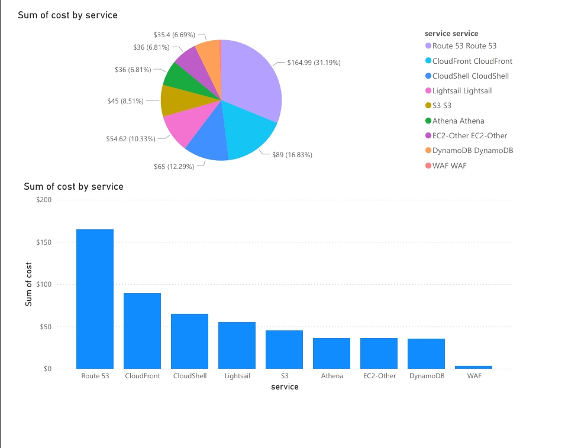

# AWS FinOps Cost Dashboard

## Overview
Financial Operations dashboard analyzing AWS service costs using Power BI and Amazon Athena.

## Dashboard

## Documentation
- [AWS Cost Analysis Report](./AWS%20Cost%20Analysis.pdf)

## Key Insights
- Route 53: $164.99 (highest cost)
- Lightsail: $54.62 
- Athena & EC2-Other: $36.00 each

## Tools Used
- Amazon Athena (data querying)
- Power BI (visualization)
- AWS Cost Explorer data